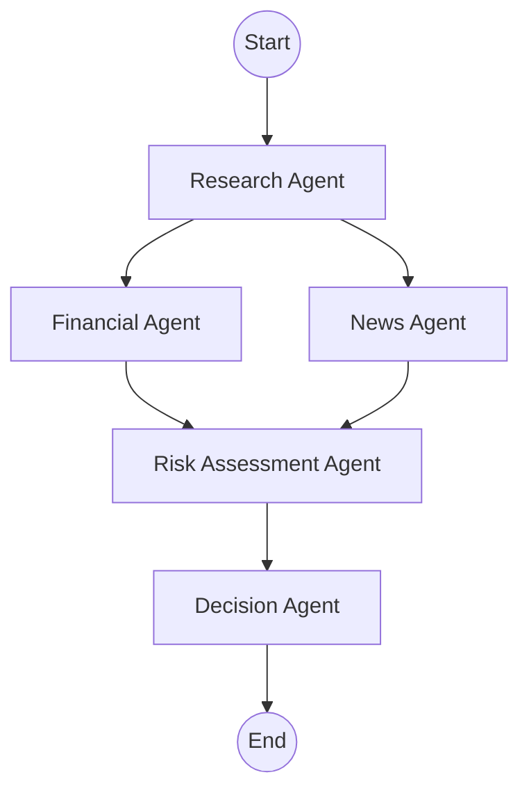

# 🚀 AlphaLens AI — Multi-Agent Investment Research Platform

<p align="center">
  <strong>An AI-powered investment research platform built using LangGraph, OpenRouter, React, Node.js, and Finnhub APIs.</strong>
</p>

<p align="center">
  Autonomous AI agents collaborate to analyze publicly traded companies, evaluate financial health, assess market sentiment, measure investment risk, and generate explainable BUY/PASS recommendations with interactive dashboards and downloadable PDF reports.
</p>

---

## 📌 Project Badges


---

# 🌐 Live Demo

### 🖥️ Frontend

https://alphalens-investment-research-frontend.onrender.com 

### 📂 GitHub Repository

https://github.com/rk-ritik-raj/alphalens-investment-research

# 🎥 Demo Video

A complete walkthrough of the project, including the multi-agent workflow, dashboard, report generation, and deployment, is available here:

https://drive.google.com/file/d/1ypdJ8iN9CV8eeWLuNTSyMl-XVLxzqMHe/view?usp=drivesdk

---

# 📖 Project Overview

Investment research often requires analysts to collect information from multiple sources, including company profiles, financial statements, market news, and risk indicators. This process is time-consuming, repetitive, and difficult to scale.

**AlphaLens AI** automates this workflow by orchestrating multiple specialized AI agents through **LangGraph**. Each agent is responsible for a specific stage of the investment research process, allowing the platform to generate structured, explainable, and data-driven investment reports.

The platform combines real-time financial data from **Finnhub**, natural language reasoning using **OpenRouter LLMs**, and a modular multi-agent architecture to deliver comprehensive investment insights through an intuitive web interface.

---

# ✨ Key Features

### 🤖 Multi-Agent AI Workflow

- Research Agent
- Financial Analysis Agent
- News Sentiment Agent
- Risk Assessment Agent
- Decision Synthesis Agent

---

### 📊 Company Analysis

- Company profile generation
- Business overview
- Industry classification
- Financial health evaluation
- Revenue and valuation metrics
- Market sentiment analysis
- Investment risk scoring
- Explainable BUY/PASS recommendation

---

### 📈 Interactive Dashboard

- Professional analytics dashboard
- Financial metrics visualization
- Risk analysis panels
- News sentiment summaries
- AI-generated investment recommendations
- Confidence scoring

---

### 📄 PDF Report Generation

Generate downloadable investment research reports containing:

- Company overview
- Financial analysis
- News analysis
- Risk assessment
- Final recommendation
- Executive investment summary

---

### ⚡ Performance Optimizations

- LangGraph-based workflow orchestration
- Parallel agent execution
- Company resolution caching
- AI provider fallback strategy
- Optimized API payloads
- Structured logging
- Retry with exponential backoff

---

### 🛡️ Robust Error Handling

The platform gracefully handles:

- Invalid company names
- API failures
- Network interruptions
- AI provider rate limits
- Missing financial metrics
- Empty news responses

without breaking the overall workflow.

---

# 🎯 Project Highlights

- ✅ Autonomous Multi-Agent AI Architecture
- ✅ LangGraph State-Based Orchestration
- ✅ Provider-Agnostic AI Service Layer
- ✅ OpenRouter Integration
- ✅ Finnhub Financial APIs
- ✅ Interactive Analytics Dashboard
- ✅ PDF Report Generation
- ✅ Company History Tracking
- ✅ Professional Full-Stack Architecture
- ✅ Fully Deployed on Render

---

# 🖼️ Application Preview

> **Screenshots will be added here**

- 🏠 Home Page
- 🔄 Multi-Agent Processing
- 📊 Dashboard
- 📄 Report Details
- 📜 Report History
- 📥 PDF Export

---


# 🏗️ System Architecture

AlphaLens AI follows a modular **Multi-Agent Architecture** powered by **LangGraph**. Each AI agent is responsible for a specific stage of the investment research process and communicates through a shared state. This design improves modularity, scalability, and maintainability while producing explainable investment recommendations.

The workflow begins with resolving the company, followed by financial and news analysis. Risk assessment is then performed using the collected insights, and finally a decision agent generates an explainable **BUY** or **PASS** recommendation.

---

## 🧠 LangGraph Workflow



### Workflow Explanation

### 🔍 Research Agent

- Resolves the company name and stock ticker.
- Collects company profile information.
- Generates business overview and industry insights.

---

### 📊 Financial Agent

- Retrieves financial metrics using Finnhub APIs.
- Evaluates valuation ratios, profitability, liquidity, and growth.
- Produces structured financial analysis.

---

### 📰 News Agent

- Fetches recent company news.
- Performs sentiment analysis.
- Identifies major business events impacting the company.

---

### ⚠️ Risk Assessment Agent

- Combines research, financial, and news outputs.
- Evaluates business, financial, market, and operational risks.
- Generates an overall investment risk score.

---

### ✅ Decision Agent

- Synthesizes all previous agent outputs.
- Generates the final investment recommendation.
- Produces confidence score, reasoning, advantages, disadvantages, and investment summary.

---

# 💻 Technology Stack

| Category | Technologies |
|-----------|--------------|
| Frontend | React, Vite, Tailwind CSS |
| Backend | Node.js, Express.js |
| AI Framework | LangChain.js, LangGraph.js |
| LLM Provider | OpenRouter |
| Financial Data | Finnhub API |
| Charts | Recharts |
| PDF Generation | PDFKit |
| HTTP Client | Axios |
| Database | JSON File Storage |
| Deployment | Render |
| Version Control | Git & GitHub |

---

# 📂 Project Structure

```text
AlphaLens-AI
│
├── backend
│   ├── data
│   │   └── reports.json
│   │
│   ├── src
│   │   ├── agents
│   │   ├── config
│   │   ├── controllers
│   │   ├── graph
│   │   ├── prompts
│   │   ├── routes
│   │   ├── services
│   │   ├── state
│   │   ├── tools
│   │   ├── utils
│   │   ├── app.js
│   │   └── server.js
│   │
│   └── tests
│       ├── integration
│       └── unit
│
├── frontend
│   ├── public
│   └── src
│       ├── components
│       ├── pages
│       ├── services
│       ├── App.jsx
│       └── main.jsx
│
├── README.md
└── package.json
```

---

# ⚙️ Why This Architecture?

### ✔ Multi-Agent Design

Instead of relying on a single AI prompt, AlphaLens AI divides the workflow into specialized agents. Each agent focuses on a specific responsibility, resulting in better modularity, easier debugging, and improved reasoning quality.

### ✔ LangGraph Orchestration

LangGraph manages the execution flow using a shared state, allowing each agent to read and update information without tightly coupling components. This makes the workflow easier to extend and maintain.

### ✔ Provider-Agnostic AI Layer

All Large Language Model interactions are centralized through **AIService**, allowing the application to switch between providers such as OpenRouter, Gemini, or OpenAI with minimal code changes.

### ✔ Modular Backend

The backend separates controllers, tools, services, utilities, prompts, and agents into dedicated modules, making the codebase clean, scalable, and easier to test.

### ✔ Scalable Design

The architecture supports adding new AI agents (for example, ESG Analysis, Portfolio Optimization, or Technical Analysis) without modifying the existing workflow.

---


# ⚙️ Installation & Setup

Follow these steps to run AlphaLens AI locally.

---

## 📋 Prerequisites

Make sure the following software is installed on your system:

- Node.js (v18 or higher)
- npm (comes with Node.js)
- Git
- OpenRouter API Key
- Finnhub API Key

---

## 📥 Clone the Repository

```bash
git clone https://github.com/rk-ritik-raj/alphalens-investment-research.git

cd alphalens-investment-research
```

---

## 📦 Install Backend Dependencies

```bash
cd backend
npm install
```

---

## 📦 Install Frontend Dependencies

```bash
cd ../frontend
npm install
```

---

# 🔑 Environment Variables

Create a `.env` file inside the **backend** directory.

```env
PORT=5000

OPENROUTER_API_KEY=your_openrouter_api_key

OPENROUTER_MODEL=deepseek/deepseek-chat-v3-0324:free

FINNHUB_API_KEY=your_finnhub_api_key
```

### Environment Variables Explained

| Variable | Description |
|-----------|-------------|
| `PORT` | Backend server port |
| `OPENROUTER_API_KEY` | API key for OpenRouter LLM access |
| `OPENROUTER_MODEL` | Default OpenRouter model used for AI reasoning |
| `FINNHUB_API_KEY` | API key for retrieving financial market data |

---

## ▶️ Start the Backend Server

```bash
cd backend
npm run dev
```

The backend will start at:

```
http://localhost:5000
```

---

## ▶️ Start the Frontend

Open another terminal:

```bash
cd frontend
npm run dev
```

The frontend will start at:

```
http://localhost:5173
```

---

## 🌍 Production Deployment

The project is deployed on **Render**.

### Frontend

https://alphalens-investment-research-frontend.onrender.com


---

# 🔌 REST API Endpoints

The backend exposes REST APIs for company research, report retrieval, and PDF generation.

| Method | Endpoint | Description |
|----------|-----------------------------|------------------------------------------|
| POST | `/api/research` | Generate a complete investment research report |
| GET | `/api/history` | Retrieve previously generated reports |
| GET | `/api/report/:id` | Fetch a specific investment report |
| GET | `/api/report/:id/pdf` | Download the investment report as a PDF |

---

## Example Request

### POST `/api/research`

```http
POST /api/research
Content-Type: application/json
```

Request Body

```json
{
  "company": "Apple"
}
```

---

## Example Success Response

```json
{
  "success": true,
  "data": {
    "id": "6871c53d",
    "company": "Apple",
    "symbol": "AAPL",
    "decision": {
      "recommendation": "BUY",
      "confidence": 82
    }
  }
}
```

---

## Example Error Response

```json
{
  "success": false,
  "message": "Company could not be resolved."
}
```

---

# 🔄 Request Lifecycle

The following sequence illustrates how a research request is processed.

```text
React Frontend
       │
       ▼
Axios API Service
       │
       ▼
Express Route
       │
       ▼
Research Controller
       │
       ▼
LangGraph Workflow
       │
       ▼
Research Agent
       │
 ┌─────┴─────┐
 ▼           ▼
Financial   News
   │           │
   └─────┬─────┘
         ▼
Risk Assessment
         ▼
Decision Agent
         ▼
JSON Report
         ▼
PDF Report
         ▼
Frontend Dashboard
```

---

# 📄 Generated Output

For every successful company search, AlphaLens AI automatically generates:

- Company Profile
- Business Overview
- Financial Analysis
- News Sentiment Analysis
- Risk Assessment
- Final BUY/PASS Recommendation
- Confidence Score
- Executive Investment Summary
- Downloadable PDF Report
- Historical Report Record

---

# ⚡ Performance Optimizations

Several optimizations were implemented to improve responsiveness, reliability, and maintainability while working with external AI and financial data providers.

### Implemented Optimizations

- **Parallel LangGraph Execution**
  - Independent agent nodes execute concurrently where applicable, reducing overall workflow execution time.

- **Company Resolution Cache**
  - Frequently resolved company names and ticker symbols are cached during a request to eliminate duplicate lookups.

- **Optimized Prompt Payloads**
  - Financial metrics and news data are filtered before being sent to the LLM, reducing token usage and response latency.

- **OpenRouter Fallback Models**
  - If the primary model becomes unavailable or rate-limited, the AI service automatically switches to configured fallback models.

- **Retry with Exponential Backoff**
  - Retryable API failures (429, 5xx, network timeouts) are handled automatically using exponential backoff.

- **Structured Logging**
  - Each request logs execution metadata including provider, selected model, execution duration, and request identifier.

- **Centralized AI Service**
  - All LLM communication is managed through a single AIService layer, simplifying maintenance and provider switching.

---

# 🏛️ Engineering Decisions

Several architectural decisions were made to keep the application modular, scalable, and maintainable.

| Decision | Reason |
|----------|--------|
| **LangGraph** | Provides structured workflow orchestration with shared state management for multi-agent execution. |
| **Multi-Agent Architecture** | Separates research, financial analysis, news analysis, risk evaluation, and investment decisions into specialized AI agents. |
| **Shared State** | Allows agents to collaborate without tightly coupling components, making the workflow easier to extend. |
| **AIService Abstraction** | Decouples business logic from the LLM provider, enabling migration between OpenRouter, Gemini, or other providers with minimal code changes. |
| **OpenRouter** | Offers access to multiple LLM providers through a single API, reducing vendor lock-in. |
| **Finnhub API** | Supplies real-time company profiles, financial metrics, and market news used throughout the workflow. |
| **Render Deployment** | Provides a simple cloud deployment for both frontend and backend services. |
| **JSON Storage** | Lightweight local persistence suitable for development and demonstration purposes. |

---

# 📌 Assumptions

During development, the following assumptions were made:

- The platform analyzes only publicly traded companies.
- Financial data is retrieved from Finnhub APIs.
- AI reasoning is generated using OpenRouter models.
- Investment recommendations are generated for educational and demonstration purposes only and should not be considered financial advice.
- JSON file storage was selected for simplicity during development. In a production environment, PostgreSQL or MongoDB would be more suitable.

---

# 🧪 Testing & Validation

The platform was validated through both automated testing and manual end-to-end verification.

## Unit Testing

Individual modules were tested independently to verify business logic without relying on live external services.

### Components Tested

- Company Resolver
- AIService
- JSON Parser
- LangGraph State
- PDF Generator
- Database Utilities

Run:

```bash
node tests/unit/testAllCompanies.mock.js
```

---

## Integration Testing

Integration tests validate the complete workflow using live APIs.

### Components Tested

- OpenRouter Connectivity
- Finnhub APIs
- LangGraph Workflow
- Multi-Agent Execution
- Report Generation
- PDF Generation
- Report Persistence

Run:

```bash
node tests/integration/testAllCompanies.real.js
```

---

## Manual End-to-End Validation

The complete workflow was manually verified using multiple publicly traded companies, including:

- Apple
- Microsoft
- NVIDIA
- Tesla
- Amazon
- Google
- Meta
- Adobe
- Oracle
- Netflix
- Infosys
- TCS
- Reliance
- Samsung
- Toyota

For each company, the following workflow was successfully verified:

- ✅ Company Resolution
- ✅ Company Profile Generation
- ✅ Financial Analysis
- ✅ News Sentiment Analysis
- ✅ Risk Assessment
- ✅ Investment Recommendation
- ✅ Dashboard Rendering
- ✅ PDF Report Generation
- ✅ Report History Storage

---

# 📊 Known Performance Considerations

The overall execution time depends on several external factors:

- OpenRouter model availability
- Selected LLM model
- Network latency
- Finnhub API response time
- External API rate limits

While response times may vary depending on external providers, the platform is designed to remain resilient through caching, retry strategies, provider fallbacks, and structured error handling.

---

# 📊 Example Runs

The following examples demonstrate the type of investment analysis generated by AlphaLens AI.

---

## Example 1 – Apple Inc. (AAPL)

**Recommendation:** BUY

**Confidence:** 82%

**Reasoning:**

- Strong financial performance
- Positive recent news sentiment
- Healthy profitability
- Low investment risk

---

## Example 2 – Tesla Inc. (TSLA)

**Recommendation:** PASS

**Confidence:** 74%

**Reasoning:**

- High market valuation
- Mixed market sentiment
- Increased volatility
- Moderate investment risk

---

## Example 3 – Microsoft Corporation (MSFT)

**Recommendation:** BUY

**Confidence:** 86%

**Reasoning:**

- Strong cloud business growth
- Consistent financial performance
- Positive market outlook
- Stable long-term investment profile

---  

# 🌍 Deployment

AlphaLens AI is fully deployed on **Render**, allowing the application to be accessed without any local setup.

| Service | Platform | URL |
|----------|----------|-----|
| **Frontend** | Render Static Site | https://alphalens-investment-research-frontend.onrender.com |


### Deployment Highlights

- Fully cloud-hosted using **Render**
- Frontend and backend deployed as independent services
- Environment variables securely configured through Render
- Frontend communicates with the deployed backend using REST APIs
- Supports downloadable PDF reports and report history in the deployed environment

---

# 🤖 AI-Assisted Development Journey

This project was developed using an **AI-assisted software engineering workflow**, combining manual development with AI tools throughout the implementation process.

AI assistance was used for:

- System architecture planning
- LangGraph workflow design
- Prompt engineering
- Multi-agent orchestration
- API integration
- Error debugging
- Performance optimization
- Documentation refinement

Every AI-generated suggestion was **carefully reviewed, tested, modified where necessary, and integrated manually** before becoming part of the final implementation.

This approach accelerated development while ensuring that the final architecture, implementation, and engineering decisions remained fully understood and validated.

> **Note:** The AI conversation transcripts used during development are included separately as part of the assignment submission, in accordance with the project requirements.

---

# 🚀 Future Improvements

Although the current platform is fully functional, several enhancements can further improve its capabilities.

## Platform Features

- User Authentication & Authorization
- Portfolio Watchlists
- Multi-Company Comparison
- Stock Alerts & Notifications
- Portfolio Risk Dashboard
- Earnings Calendar Integration

---

## AI Enhancements

- Technical Analysis Agent
- ESG Analysis Agent
- Earnings Call Analysis Agent
- Portfolio Recommendation Agent
- Retrieval-Augmented Generation (RAG)
- Long-Term Conversational Memory

---

## Infrastructure Improvements

- PostgreSQL Database
- Redis Caching
- Docker Containerization
- CI/CD Pipeline
- Kubernetes Deployment
- Background Job Queue

---

## Additional Data Sources

- Tavily Search API
- Alpha Vantage
- Yahoo Finance
- Polygon.io
- SEC Filings
- Additional Financial News Providers

---

# 💡 Key Learnings

Developing AlphaLens AI provided hands-on experience with:

- Multi-Agent AI Systems
- LangGraph Workflow Orchestration
- LangChain
- Prompt Engineering
- OpenRouter API Integration
- Financial Data APIs
- REST API Development
- State Management
- Performance Optimization
- Error Handling & Resilience
- Full-Stack Application Development
- Cloud Deployment using Render

---

# 🏆 Project Outcome

AlphaLens AI demonstrates how multiple specialized AI agents can collaborate to automate complex investment research workflows.

The project combines modern web technologies, Large Language Models, financial market APIs, and state-based orchestration to deliver structured, explainable investment analysis through a responsive full-stack application.

This project also showcases practical experience in:

- Full-Stack Development
- AI Integration
- Multi-Agent System Design
- LangGraph Orchestration
- Software Architecture
- API Integration
- Cloud Deployment
- Production-Oriented Engineering Practices

---

# 💬 AI Development Logs

This project was developed using an AI-assisted software engineering workflow.

As requested in the assignment, the complete AI conversation transcripts used during planning, implementation, debugging, optimization, and documentation are included separately with the project submission.

These conversations demonstrate the complete engineering process followed during development.

---

# 🤝 Contributing

Contributions, suggestions, and improvements are always welcome.

If you find any issues or have ideas for improvements:

1. Fork the repository
2. Create a new branch
3. Commit your changes
4. Open a Pull Request

---

# 👨‍💻 Author

## Ritik Kumar

**B.Tech – Computer Science & Engineering**

Lovely Professional University

### Connect with me

**GitHub**

https://github.com/rk-ritik-raj

**LinkedIn**

https://www.linkedin.com/in/rk-ritik/

**Email**

rk4768747@gmail.com

---

# ⭐ If You Like This Project

If you found this project useful, consider giving it a ⭐ on GitHub.

It helps others discover the project and motivates further development.

---

# 📜 License

This project was developed for educational purposes as part of the **InsideIIM × AltUni AI Labs – Full Stack AI Engineering Internship Assignment**.

It is intended to demonstrate:

- Full-Stack Development
- Multi-Agent AI Systems
- LangGraph Workflow Orchestration
- LLM Integration
- AI-Assisted Software Engineering
- Production-Oriented System Design

The project may also serve as a portfolio project showcasing modern AI-powered application development.

---

<p align="center">

### 🚀 Built with ❤️ using React, Node.js, LangGraph, OpenRouter, and Finnhub

**Thank you for visiting AlphaLens AI!**

</p>
