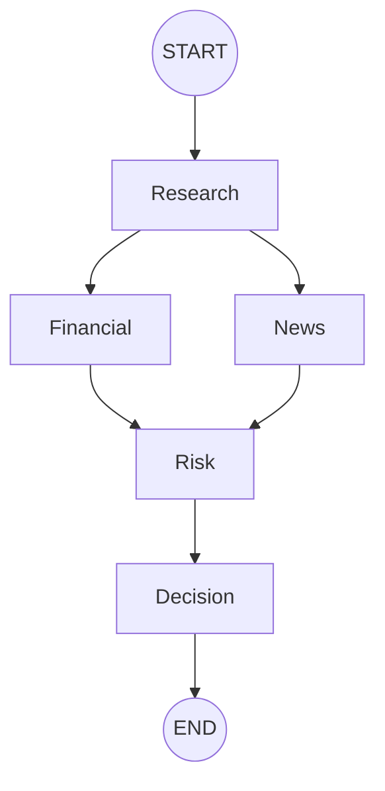

# 🚀 AlphaLens AI – Multi-Agent Investment Research Platform

<p align="center">

AI-Powered • Multi-Agent • LangGraph • OpenRouter • React • Node.js • Financial Intelligence

</p>

<p align="center">

An autonomous investment research platform that simulates how a professional investment team evaluates publicly listed companies using specialized AI agents.

</p>

---

## 📖 Overview

AlphaLens AI is an AI-powered investment research platform that automates the process of analyzing publicly traded companies. Instead of relying on a single Large Language Model response, the platform decomposes the research process into multiple specialized AI agents coordinated using **LangGraph**.

Each agent is responsible for a specific stage of the investment pipeline—from collecting company information to evaluating financial health, analyzing recent news, assessing investment risks, and finally generating an explainable investment recommendation.

The goal of this project is to demonstrate how modern AI systems can orchestrate multiple specialized agents to solve complex analytical tasks while maintaining modularity, explainability, and scalability.

---

## 🎯 Problem Statement

Performing investment research manually requires gathering information from multiple sources including:

- Company fundamentals
- Financial statements
- Recent news
- Market sentiment
- Risk factors
- Business overview

This process is both time-consuming and difficult to repeat consistently.

AlphaLens AI automates this workflow by coordinating multiple AI agents that collaborate through a shared state graph to produce a structured investment report.

---

## ✨ Key Features

### 🤖 Multi-Agent Architecture
- Research Agent
- Financial Analysis Agent
- News Analysis Agent
- Risk Assessment Agent
- Decision Synthesis Agent

---

### 🧠 LangGraph Workflow

Uses LangGraph's StateGraph orchestration engine to execute AI agents while maintaining a shared immutable state.

---

### 📈 Financial Analysis

- Company Profile
- Market Capitalization
- Financial Ratios
- Revenue Metrics
- Profitability Analysis

---

### 📰 News Intelligence

- Latest Company News
- News Summarization
- Sentiment Analysis
- Market Impact Detection

---

### ⚠️ Risk Assessment

Evaluates multiple investment risk dimensions including:

- Business Risk
- Financial Risk
- Market Risk
- Technology Risk
- Competitive Risk
- Regulatory Risk

---

### 📊 Interactive Dashboard

Modern SaaS dashboard including

- Recommendation Card
- Confidence Score
- Risk Radar Chart
- News Sentiment Graph
- Financial Metrics
- Investment Summary
- Pros & Cons
- PDF Export

---

### 📄 PDF Report Generation

Generate professional investment reports for every completed analysis.

---

### 🗂 Research History

Stores previously generated reports for later review.

---

### ⚡ Performance Optimizations

- LangGraph Parallel Execution
- Company Resolution Cache
- HTTP Request Caching
- Prompt Size Optimization
- Token Optimization
- Retry Mechanism
- OpenRouter Model Fallback
- Structured Logging

---

## 🛠 Technology Stack

### Frontend

- React.js
- Vite
- Tailwind CSS
- React Router
- Axios
- Recharts
- Lucide Icons

---

### Backend

- Node.js
- Express.js
- LangGraph.js
- OpenRouter API
- Finnhub API
- PDFKit

---

### AI Technologies

- Multi-Agent Architecture
- LangGraph StateGraph
- Prompt Engineering
- Structured JSON Outputs
- LLM Orchestration

---

### Development Tools

- Git
- GitHub
- Postman
- VS Code
- Nodemon

---

## 📷 Screenshots

> Replace the placeholders below with screenshots before submission.

### 🏠 Home Page


---

### 🔄 Multi-Agent Execution


---

### 📊 Dashboard


---

### 📄 Investment Report


---

### 📚 Research History


---

## 🌐 Live Demo

### Frontend

```
https://your-frontend-url
```

### Backend

```
https://your-backend-url
```

### GitHub Repository

```
https://github.com/yourusername/AlphaLens-AI
```

---

## 🎥 Demo Video

> Add your walkthrough video link here.

```
https://your-demo-video-link
```

---

## 📌 Project Highlights

✔ Multi-Agent Investment Research

✔ LangGraph State Machine

✔ OpenRouter LLM Integration

✔ Finnhub Financial APIs

✔ Explainable AI Decisions

✔ Professional Dashboard

✔ PDF Report Generation

✔ Research History

✔ Modular Architecture

✔ Provider-Agnostic AI Layer

✔ Interview-Ready Engineering Design

---

# 🏗️ System Architecture

AlphaLens AI follows a modular, multi-agent architecture where each AI agent performs a specialized task within the investment research pipeline. The workflow is orchestrated using **LangGraph's StateGraph**, enabling structured execution, shared state management, and scalable agent coordination.

Unlike traditional chatbot architectures that rely on a single LLM call, AlphaLens AI decomposes the investment analysis process into multiple independent reasoning stages.

---

# 🧠 High-Level Architecture

```text
                    +----------------------+
                    |      React UI        |
                    |  Search Company      |
                    +----------+-----------+
                               |
                               |
                               ▼
                    +----------------------+
                    | Express REST API     |
                    +----------+-----------+
                               |
                               ▼
                  research.controller.js
                               |
                               ▼
                  runInvestmentWorkflow()
                               |
                               ▼
                LangGraph StateGraph Engine
                               |
      ┌────────────────────────┼────────────────────────┐
      │                        │                        │
      ▼                        ▼                        ▼
 Research Agent         Financial Agent         News Agent
      │                        │                        │
      └───────────────┬────────┴───────────────┘
                      ▼
               Risk Assessment Agent
                      │
                      ▼
             Decision Synthesis Agent
                      │
                      ▼
          Final Investment Recommendation
                      │
                      ▼
        Dashboard + PDF + History Database
```

---

# 🔄 LangGraph Workflow

The application uses **LangGraph** to coordinate multiple AI agents through a shared immutable state.



### Workflow Explanation

### Step 1 — Research Agent

Responsible for:

- Resolving company name
- Resolving ticker symbol
- Fetching company profile
- Understanding business model
- Identifying strengths
- Identifying weaknesses

Output:

```text
companyProfile
research
symbol
```

---

### Step 2 — Financial Agent

Responsible for:

- Market Cap
- Revenue
- Profitability
- Liquidity
- Debt
- Financial Ratios
- Financial Health

Output

```text
financialData
```

---

### Step 3 — News Agent

Responsible for

- Latest News
- News Summaries
- Sentiment Analysis
- Positive Events
- Negative Events
- Market Impact

Output

```text
news
```

---

### Step 4 — Risk Assessment Agent

Combines outputs from

- Company Profile
- Financial Metrics
- News Analysis
- Research Summary

Produces

```text
riskAnalysis
```

Including

- Competition Risk
- Technology Risk
- Financial Risk
- Market Risk
- Regulatory Risk
- Business Risk

---

### Step 5 — Decision Agent

Consumes every previous result

Produces

```text
decision
```

Including

- BUY / PASS Recommendation
- Confidence Score
- Investment Summary
- Pros
- Cons
- Final Reasoning

---

# 📊 Shared State Flow

Every LangGraph node reads and updates only the portion of state that belongs to it.

```text
Initial State

{
 company
}

        │
        ▼

Research Agent

Reads

company

Writes

symbol
companyProfile
research

        │
        ▼

Financial Agent

Reads

symbol

Writes

financialData

        │
        ▼

News Agent

Reads

symbol

Writes

news

        │
        ▼

Risk Agent

Reads

companyProfile
research
financialData
news

Writes

riskAnalysis

        │
        ▼

Decision Agent

Reads

companyProfile
research
financialData
news
riskAnalysis

Writes

decision

        │
        ▼

Final State Returned
```

---

# 📦 Shared State Schema

The StateGraph maintains a centralized state throughout execution.

| State Property | Description |
|---------------|-------------|
| company | User input |
| symbol | Resolved ticker |
| companyProfile | Company metadata |
| research | Business overview |
| financialData | Financial metrics |
| news | News analysis |
| riskAnalysis | Risk evaluation |
| decision | Final recommendation |
| errors | Collected workflow errors |
| meta | Execution metadata |

---

# 🤖 AI Agents

## 🔍 Research Agent

Responsibilities

- Resolve ticker
- Understand business model
- Generate business summary
- Identify strengths
- Identify weaknesses

Uses

- Finnhub
- OpenRouter LLM

---

## 📈 Financial Agent

Responsibilities

- Analyze financial metrics
- Calculate ratios
- Evaluate profitability
- Generate financial health summary

Uses

- Finnhub Metrics API
- OpenRouter LLM

---

## 📰 News Agent

Responsibilities

- Retrieve recent company news
- Summarize articles
- Perform sentiment analysis
- Identify market events

Uses

- Finnhub News API
- OpenRouter LLM

---

## ⚠️ Risk Agent

Responsibilities

Evaluate

- Competition
- Technology
- Debt
- Regulation
- Market
- Industry

Produces

Composite investment risk profile.

---

## 🎯 Decision Agent

Consumes outputs from every previous agent.

Generates

- Recommendation
- Confidence
- Investment Summary
- Pros
- Cons
- Final Explanation

---

# 📂 Project Structure

```text
AlphaLens-AI

├── backend
│
├── src
│   ├── agents
│   ├── config
│   ├── controllers
│   ├── graph
│   ├── prompts
│   ├── routes
│   ├── services
│   ├── state
│   ├── tools
│   ├── utils
│   ├── app.js
│   └── server.js
│
├── frontend
│
├── src
│   ├── components
│   ├── pages
│   ├── services
│   ├── App.jsx
│   └── main.jsx
│
└── README.md
```

---

# 🏛️ Architectural Decisions

## Why LangGraph?

Instead of chaining multiple async functions together, LangGraph provides a structured execution engine with shared state management. This makes the workflow easier to extend, debug, and maintain as additional AI agents are introduced.

---

## Why Multi-Agent Architecture?

Investment research naturally consists of distinct tasks such as company profiling, financial analysis, news interpretation, risk evaluation, and decision making. Splitting these responsibilities across specialized agents results in clearer prompts, modular logic, and better maintainability.

---

## Why AIService?

The AIService layer abstracts all communication with external LLM providers. Agents remain provider-independent and interact only through a common interface. This design allows switching between OpenRouter, Gemini, OpenAI, or other providers with minimal changes to the application.

---

## Why Shared State?

Rather than passing dozens of parameters between agents, a centralized state object enables each node to read only the information it requires and update only the fields it owns. This improves scalability and reduces coupling between components.

---

# ⚙️ Installation & Setup

This project consists of two independent applications:

- **Frontend** → React + Vite + Tailwind CSS
- **Backend** → Node.js + Express + LangGraph

Both applications must be running simultaneously.

---

# 📋 Prerequisites

Before running the project, ensure the following are installed:

| Software | Version |
|----------|----------|
| Node.js | 18+ |
| npm | Latest |
| Git | Latest |

---

# 🔑 API Keys Required

The platform integrates with external AI and financial data providers.

| Provider | Purpose |
|----------|----------|
| OpenRouter | LLM Inference |
| Finnhub | Financial Data & Company News |

---

# 📂 Clone Repository

```bash
git clone https://github.com/yourusername/AlphaLens-AI.git

cd AlphaLens-AI
```

---

# 📦 Backend Installation

```bash
cd backend

npm install
```

---

# 📦 Frontend Installation

```bash
cd ../frontend

npm install
```

---

# 🔐 Environment Variables

Create a `.env` file inside the backend folder.

```env
PORT=5000

OPENROUTER_API_KEY=your_openrouter_api_key

OPENROUTER_MODEL=deepseek/deepseek-chat-v3-0324:free

FINNHUB_API_KEY=your_finnhub_api_key
```

---

# 🚀 Running the Backend

```bash
cd backend

npm run dev
```

Expected output

```text
🚀 Server running on http://localhost:5000
```

---

# 🚀 Running the Frontend

```bash
cd frontend

npm run dev
```

Expected output

```text
VITE v7.x

Local:

http://localhost:5173
```

Open

```
http://localhost:5173
```

---

# 🧪 Project Workflow

1. User enters company name

↓

2. Backend resolves ticker

↓

3. Company profile retrieved

↓

4. LangGraph starts execution

↓

5. Research Agent executes

↓

6. Financial Agent executes

↓

7. News Agent executes

↓

8. Risk Agent executes

↓

9. Decision Agent executes

↓

10. Dashboard generated

↓

11. PDF Report generated

↓

12. Report saved into history

---

# 🌍 REST API Endpoints

## Research Company

POST

```http
/api/research
```

### Request

```json
{
    "company":"Apple"
}
```

### Success Response

```json
{
    "success":true,
    "data":{
        "id":"65ab92391",
        "company":"Apple",
        "recommendation":"BUY",
        "confidence":84
    }
}
```

---

## Get Research History

GET

```http
/api/history
```

Response

```json
[
   {
      "id":"1",
      "company":"Apple"
   },
   {
      "id":"2",
      "company":"Tesla"
   }
]
```

---

## Get Report

GET

```http
/api/report/:id
```

Example

```http
/api/report/12345
```

---

## Download PDF

GET

```http
/api/report/:id/pdf
```

Returns

```
application/pdf
```

---

# 📄 Generated Report

Each report contains

- Company Profile
- Business Summary
- Financial Analysis
- News Analysis
- Risk Assessment
- Recommendation
- Confidence Score
- Pros
- Cons
- Investment Summary

---

# 🧪 Testing Strategy

The project contains two categories of tests.

## Unit Tests

Purpose

Verify business logic without depending on external APIs.

Run

```bash
node tests/unit/testAllCompanies.mock.js
```

Tests

- Company Resolver
- AIService
- PDF Generator
- Database
- LangGraph State Updates

---

## Integration Tests

Purpose

Validate the complete system using live APIs.

Run

```bash
node tests/integration/testAllCompanies.real.js
```

Tests

- OpenRouter
- Finnhub
- LangGraph
- Dashboard Pipeline
- PDF Generation

---

# 📊 Example Companies

The following companies have been verified during development.

- Apple
- Microsoft
- NVIDIA
- Tesla
- Amazon
- Meta
- Google
- Netflix
- Adobe
- Oracle
- Infosys
- Reliance
- Toyota
- Samsung
- TCS

---

# 🌐 Deployment

The application can be deployed using:

## Frontend

- Vercel
- Netlify

---

## Backend

- Render
- Railway

---

## Database

Current

```
JSON Flat File
```

Production Recommendation

```
PostgreSQL

or

MongoDB
```

---

# 📈 Performance Notes

The application includes several optimizations.

✔ Parallel LangGraph Execution

✔ Prompt Size Reduction

✔ Company Resolution Cache

✔ HTTP Request Retry

✔ AI Provider Fallback

✔ JSON Validation

✔ Structured Logging

✔ Request Timing

---

# ⚠ Known Limitations

The current version uses free-tier APIs.

Possible limitations include

- OpenRouter queue delays
- Finnhub free-tier restrictions
- Rate limits
- Flat-file database
- No user authentication

These limitations do not affect the overall architecture and can be addressed by upgrading providers or infrastructure.

---

# 💡 Troubleshooting

## 401 Unauthorized

Check

```
OPENROUTER_API_KEY
```

---

## 429 Rate Limit

The selected OpenRouter model is busy.

Try another free model or wait a few minutes.

---

## Finnhub 403

The requested ticker is not available on the Finnhub free tier.

The application falls back gracefully whenever possible.

---

## Frontend cannot connect

Ensure

```
Backend running

↓

http://localhost:5000
```

and

```
Frontend running

↓

http://localhost:5173
```

---

# ✅ Verification Checklist

Before submission verify

- [ ] Search works
- [ ] Dashboard loads
- [ ] Charts render
- [ ] PDF downloads
- [ ] History saves
- [ ] README complete
- [ ] Screenshots added
- [ ] Demo video recorded
- [ ] GitHub repository public

# 🧠 Engineering Decisions & Design Rationale

This project was designed with a strong emphasis on modularity, maintainability, scalability, and explainability. Rather than building a traditional AI chatbot, AlphaLens AI follows a structured multi-agent architecture where each component has a single responsibility.

---

# 🏛 Why Multi-Agent Architecture?

Investment research is naturally composed of multiple independent tasks:

- Understanding the business
- Analyzing financial performance
- Reviewing recent news
- Assessing investment risks
- Producing a final investment recommendation

Instead of asking one Large Language Model to perform every task simultaneously, AlphaLens AI decomposes the workflow into specialized AI agents.

Benefits:

- Better prompt quality
- Better separation of responsibilities
- Easier debugging
- Easier prompt engineering
- Independent improvements to each agent
- More explainable outputs

---

# 🔄 Why LangGraph?

A traditional sequential workflow would require manually passing data between functions.

As the system grows, this quickly becomes difficult to maintain.

LangGraph provides:

- Shared immutable state
- Structured execution
- Node orchestration
- Execution tracing
- Parallel execution
- Easy workflow expansion

Every AI agent only reads the state it requires and updates the fields it owns.

This significantly reduces coupling between modules.

---

# 🤖 Why AIService?

Instead of calling OpenRouter directly inside every agent, the project introduces a centralized AIService.

Responsibilities:

- Provider abstraction
- Retry handling
- Timeout management
- Model fallback
- JSON validation
- Request logging

The agents never communicate directly with an LLM provider.

Instead, every request flows through:

```

ResearchAgent
↓

AIService.generate()

↓

OpenRouter

↓

Selected LLM

```

This architecture allows changing providers without modifying business logic.

For example:

OpenRouter

↓

OpenAI

↓

Claude

↓

Gemini

↓

Groq

Only AIService requires modification.

---

# 🌐 Why OpenRouter?

Initially the project used Google's Gemini API.

During development the free-tier request quota became a limiting factor.

OpenRouter was selected because it offers

- Multiple providers
- Multiple free models
- Unified REST API
- Easy provider switching
- Better scalability

The application now supports provider abstraction through AIService.

---

# 📈 Why Finnhub?

Investment recommendations require reliable financial data.

Finnhub provides

- Company Profiles
- Financial Metrics
- Company News
- Market Information

The platform separates

Market Data

↓

Finnhub

Reasoning

↓

LLM

keeping responsibilities clearly divided.

---

# 📊 Shared State Management

Instead of passing dozens of variables between agents, LangGraph maintains a centralized shared state.

Example

```

Initial State

{

company

}

↓

Research Agent

↓

companyProfile

research

symbol

↓

Financial Agent

↓

financialData

↓

News Agent

↓

news

↓

Risk Agent

↓

riskAnalysis

↓

Decision Agent

↓

decision

```

Every node only modifies its own state fields.

---

# ⚡ Performance Optimizations

The project includes multiple optimizations to improve execution time.

---

## Parallel LangGraph Execution

Originally

```

Research

↓

Financial

↓

News

↓

Risk

↓

Decision

```

Optimized

```

Research

↓

Financial

↘

Risk

↓

Decision

↗

News

```

Financial and News analysis execute simultaneously.

This reduces overall workflow latency.

---

## Company Resolution Cache

Resolved companies are cached during execution.

Example

```

Apple

↓

Resolve Symbol

↓

AAPL

↓

Cached

```

Subsequent searches avoid repeating expensive resolution logic.

Benefits

- Lower API usage
- Lower latency
- Reduced LLM requests

---

## Prompt Optimization

Large prompts increase response latency.

Optimizations include

- Reduced news articles
- Shorter summaries
- Smaller financial payloads
- Reduced token counts

These optimizations significantly reduce inference time.

---

## HTTP Request Retry

Network requests may fail because of

- Rate limits
- Temporary outages
- Gateway errors

The platform automatically retries retryable requests using exponential backoff.

Supported retry codes

- 408
- 429
- 500
- 502
- 503
- 504

---

## Model Fallback Strategy

If the primary model becomes unavailable,

AIService automatically tries another model.

Example

```

Primary

↓

deepseek/deepseek-chat-v3

↓

Failure

↓

Llama 3.3

↓

Failure

↓

Qwen

↓

Success

```

This improves system resilience.

---

## JSON Validation

LLMs occasionally produce malformed JSON.

Every response is validated before reaching the business layer.

If validation fails

↓

Retry

↓

Fallback

↓

Error Handling

This prevents downstream crashes.

---

# 🛡 Error Handling Strategy

Errors are handled at multiple layers.

---

## Input Validation

Checks

- Empty company names
- Invalid requests
- Missing parameters

---

## Company Resolution

Detects

- Unknown companies
- Misspelled names
- Invalid tickers

Returns

404

instead of crashing.

---

## External APIs

Gracefully handles

- Finnhub failures
- OpenRouter failures
- Timeouts
- Rate limits

---

## LangGraph Nodes

Every node catches exceptions independently.

Failures are recorded inside

```

errors[]

```

allowing downstream nodes to respond gracefully.

---

# 📊 Observability

The application includes structured execution logging.

Captured information includes

- Request ID
- Selected Model
- AI Provider
- Node Execution Time
- Total Workflow Duration
- Retry Count

Example

```

Research Agent

2.3 s

Financial Agent

3.1 s

News Agent

4.8 s

Risk Agent

2.0 s

Decision Agent

1.4 s

Total

13.6 s

```

These logs simplify debugging and performance analysis.

---

# 🔒 Security Considerations

Sensitive credentials are never hardcoded.

API keys are stored inside

```

.env

```

Configuration includes

- OpenRouter Key
- Finnhub Key
- Port Configuration

The repository excludes

```

.env

```

using

```

.gitignore

```

---

# 📐 Software Design Principles

The project follows several software engineering principles.

### Single Responsibility Principle

Every agent performs one task.

---

### Separation of Concerns

Frontend

↓

Presentation

Backend

↓

Business Logic

AIService

↓

LLM Communication

Finnhub

↓

Financial Data

---

### Modularity

Every module can be independently modified or replaced.

---

### Scalability

Future AI agents can be added without changing the existing workflow.

Examples

- ESG Analysis Agent

- Technical Analysis Agent

- Portfolio Optimization Agent

- Earnings Call Agent

---

# 🎯 Interview Talking Points

If asked why these architectural choices were made:

**Why LangGraph?**

> LangGraph provides structured orchestration, shared state management, and better scalability compared to manually chaining asynchronous functions.

---

**Why multiple AI agents?**

> Investment research naturally consists of multiple specialized tasks. Splitting these into dedicated agents improves maintainability, prompt quality, explainability, and debugging.

---

**Why AIService?**

> AIService abstracts provider-specific logic away from the business layer, enabling provider switching, centralized retries, timeout management, fallback handling, and consistent JSON validation.

---

**Why OpenRouter instead of a single provider?**

> OpenRouter provides access to multiple LLM providers through one API, reducing vendor lock-in and improving resilience by allowing fallback between supported models.

---

**Why a shared state instead of passing objects manually?**

> Shared state simplifies data flow, reduces coupling between agents, and makes it easier to extend the workflow without changing existing interfaces.

---


# 🧪 Testing & Validation

The platform was validated using both automated tests and manual end-to-end verification.

---

## Unit Testing

Unit tests focus on validating individual modules without relying on external providers.

### Components Tested

- Company Resolver
- AIService
- LangGraph State Updates
- JSON Parser
- PDF Generator
- Local Database Utilities

Run

```bash
node tests/unit/testAllCompanies.mock.js
```

---

## Integration Testing

Integration tests execute the complete workflow using live APIs.

Run

```bash
node tests/integration/testAllCompanies.real.js
```

Verified Components

- OpenRouter Connectivity
- Finnhub APIs
- LangGraph Workflow
- Multi-Agent Execution
- Dashboard Generation
- PDF Report Generation
- Report Persistence

---

## Manual End-to-End Testing

The application was manually tested using multiple publicly traded companies.

Examples include

- Apple
- Microsoft
- NVIDIA
- Tesla
- Amazon
- Google
- Meta
- Adobe
- Oracle
- Netflix
- Infosys
- TCS
- Reliance
- Samsung
- Toyota

For each company the following workflow was verified:

✔ Company Resolution

✔ Company Profile

✔ Financial Analysis

✔ News Analysis

✔ Risk Assessment

✔ Final Recommendation

✔ Dashboard Rendering

✔ PDF Generation

✔ History Persistence

---

# 📈 Example Output

Example:

```
Company

Apple Inc.

Recommendation

BUY

Confidence

82%

Business

Strong global ecosystem with recurring services revenue.

Financial Health

Healthy profitability and cash flow.

News Sentiment

Mostly Positive

Risk Rating

Low

Investment Summary

Long-term fundamentals remain strong with stable growth,
healthy margins, and strong market positioning.
```

---

# 📊 Performance Summary

Several engineering optimizations were implemented to improve responsiveness.

Implemented Optimizations

- Parallel LangGraph execution
- Company resolution cache
- Reduced prompt payload size
- Optimized financial payloads
- Reduced news context
- Retry with exponential backoff
- AI provider fallback
- Structured logging

The final response time depends on:

- OpenRouter model queue
- Network latency
- Finnhub API response time
- Selected AI model

---

# ⚖️ Engineering Trade-offs

Several engineering decisions intentionally balance simplicity, scalability, and development speed.

| Decision | Benefit | Trade-off |
|----------|---------|----------|
| JSON File Database | Simple local setup | Not ideal for high concurrency |
| OpenRouter Free Models | Easy access to multiple LLMs | Variable response latency |
| Finnhub Free Tier | Rich financial data | API limitations for some tickers |
| Multi-Agent Design | Better modularity and explainability | More API calls than a single-agent approach |
| LangGraph State | Structured orchestration | Additional learning curve |

---

# 🚧 Current Limitations

The current implementation has a few known limitations.

### Infrastructure

- Local JSON database
- Single server deployment
- No authentication

---

### External APIs

- Free-tier OpenRouter latency
- Finnhub rate limits
- Some international companies expose limited financial data

---

### Functional

- Single company analysis
- No portfolio tracking
- No real-time market updates
- No user accounts

These limitations do not affect the overall architecture and can be addressed in future versions.

---

# 🚀 Future Improvements

Potential future enhancements include:

### Platform Features

- User Authentication
- Portfolio Watchlists
- Multi-company Comparison
- Stock Alerts
- Earnings Calendar
- Portfolio Risk Analysis

---

### AI Features

- Technical Analysis Agent
- ESG Analysis Agent
- Earnings Call Agent
- Portfolio Recommendation Agent
- Vector Memory (RAG)
- Long-term Conversation Memory

---

### Infrastructure

- PostgreSQL
- Redis Cache
- Docker Deployment
- CI/CD Pipeline
- Kubernetes
- Background Job Queue

---

### Data Sources

- Tavily Search
- Alpha Vantage
- Yahoo Finance
- Polygon.io
- SEC Filings

---

# 🤖 AI-Assisted Development Journey

This project was developed with assistance from Large Language Models as part of an AI-assisted software engineering workflow.

AI assistance was used for:

- Initial architecture planning
- LangGraph workflow design
- Prompt engineering
- State management
- Error debugging
- API integration
- Performance optimization
- Documentation refinement

Throughout development, every AI-generated suggestion was reviewed, integrated, tested, and modified where necessary before becoming part of the final implementation.

The final architecture, project structure, testing strategy, and implementation decisions were verified through manual coding, debugging, and iterative refinement.

---

# 💡 Key Learnings

Building AlphaLens AI provided practical experience with:

- Multi-Agent AI Systems
- LangGraph
- Prompt Engineering
- AI Orchestration
- REST APIs
- OpenRouter
- Financial Data APIs
- State Management
- Error Handling
- Performance Optimization
- Software Architecture
- Technical Documentation

---

# 🎯 Interview Talking Points

If presenting this project during interviews, the following topics can be discussed:

- Why Multi-Agent AI instead of a single LLM
- LangGraph workflow orchestration
- Shared state management
- Provider abstraction using AIService
- Prompt engineering strategy
- Financial data processing
- Error handling and resilience
- Caching strategy
- Performance optimization
- Trade-offs between simplicity and scalability

---

# 📚 References

- LangGraph Documentation
- LangChain Documentation
- OpenRouter API Documentation
- Finnhub API Documentation
- React Documentation
- Express.js Documentation
- Tailwind CSS Documentation

---

# 🙌 Acknowledgements

This project combines modern web development with AI orchestration concepts and demonstrates how multiple specialized AI agents can collaborate to automate complex investment research tasks.

---

# 👨‍💻 Author

**Ritik Kumar**

B.Tech Computer Science Engineering

Lovely Professional University

GitHub:
```
https://github.com/rk-ritik-raj
```

LinkedIn:
```
https://www.linkedin.com/in/your-linkedin-profile
```

---

# 📜 License

This project was developed for educational purposes as part of the **InsideIIM × AltUni AI Labs Full Stack AI Engineering Internship Assignment**.

It may also serve as a portfolio project demonstrating modern AI-assisted software engineering, multi-agent orchestration, and full-stack development practices.